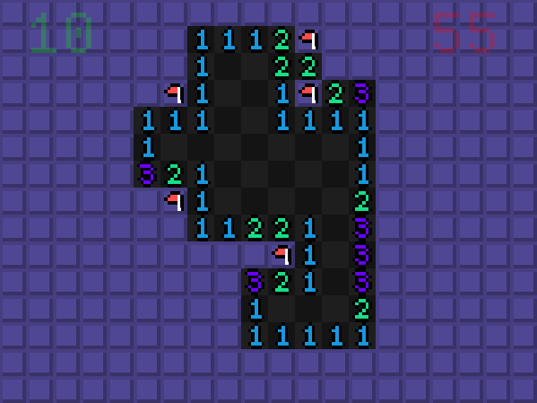

# Minesweeper rs

## [DOWNLOAD](https://github.com/wait-what/minesweeper-rs/releases)

## Features

- Adjustable width and height
- Adjustable mine count (using percentage)
- Adjustable colours
- Timer
- Area highlighting when right-clicking number
- Automatic restarts until a 0 cell is clicked

## Controls

- Left click to reveal cell
- Right click unexplored area to place a flag
- Right click a number to highlight the area it belongs to
- Space to open settings
- R to restart

## Pre-built downloads

[**DOWNLOAD HERE**](https://github.com/wait-what/minesweeper-rs/releases) if you don't feel like building it yourself

Windows and Defender will probabably get mad at the files! If you do not trust my builds, that's on you - compile it yourself

> The pre-built binaries are treated with `strip ./bin` (from `GNU binutils`) and `upx --best --lzma ./bin`

## Building

- Make sure you have rust installed and properly configured
- Clone the repostitory
- `cargo run --release`

## Contributing

Please check out [the issues](https://github.com/wait-what/minesweeper-rs/issues) if you would like to contribute to the project!
If you decide to take on an issue, be sure to comment that you are.

## License

The project is licensed under [MIT](./LICENSE)
